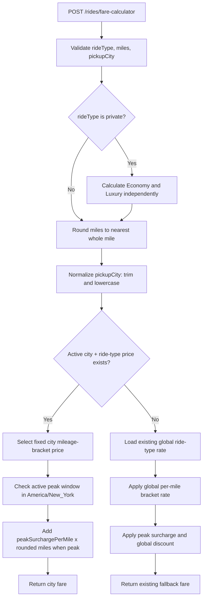

# City-Based Pricing API Guide

This guide documents how administrators configure city pricing and peak hours,
and how clients request fare calculations.

## Quick setup

The examples assume the API is running locally on port `3050`:

```bash
BASE_URL="http://localhost:3050/api"
ADMIN_TOKEN="replace-with-admin-jwt"
RIDER_TOKEN="replace-with-rider-jwt"
```

All pricing endpoints require a JWT:

```http
Authorization: Bearer <token>
```

The fare-calculator endpoint is intended for an authenticated rider client. The
admin endpoints require an authenticated admin.

## API summary

| Method | Endpoint | Purpose |
| --- | --- | --- |
| `POST` | `/admin/login` | Obtain an admin JWT |
| `GET` | `/admin/ride-rates` | List global rates, city rates, and peak windows |
| `GET` | `/admin/ride-rates?cityName=Miami` | List pricing filtered to one city or search term |
| `POST` | `/admin/city-ride-rates` | Create pricing for a city and ride type |
| `PUT` | `/admin/city-ride-rates/:id` | Update city pricing or its peak surcharge |
| `DELETE` | `/admin/city-ride-rates/:id` | Delete city pricing |
| `PUT` | `/admin/ride-rates/:rideType` | Update the existing global fallback rate |
| `GET` | `/admin/peak-windows` | List the global peak-hour windows |
| `POST` | `/admin/peak-windows` | Create a peak-hour window |
| `PUT` | `/admin/peak-windows/:id` | Update a peak-hour window |
| `DELETE` | `/admin/peak-windows/:id` | Delete a peak-hour window |
| `POST` | `/rides/fare-calculator` | Calculate a city or fallback fare |

## Fare calculation flow



City lookup is case-insensitive. `"Miami"`, `" miami "`, and `"MIAMI"` resolve
to the same city pricing record.

`pickupCity` is optional for backward compatibility. If it is missing, the city
does not exist, or its rate is inactive, the original global calculation runs.

For a `private` request, Economy and Luxury are looked up separately. For
example, Economy can use Miami pricing while Luxury falls back to its global
rate if Miami Luxury pricing has not been configured.

## City fare formula

City brackets contain fixed prices, not per-mile base rates:

```text
peak surcharge rate = isPeak ? peakSurchargePerMile : 0
peak surcharge amount = peak surcharge rate x rounded miles
total fare = fixed mileage-bracket price + peak surcharge amount
```

Example:

```text
Miami Economy 5-9 mile price: $15.00
Rounded mileage:               8 miles
Peak surcharge:                $0.25 per mile
Surcharge amount:              $2.00
Total fare:                    $17.00
```

Peak-hour windows are shared by global and city pricing. They use
`America/New_York` time. A window is evaluated as `[startHour, endHour)`, so a
window from `15` to `19` applies from 3:00 PM through 6:59 PM.

City pricing currently does not apply a discount. The existing global discount
continues to apply only when the calculation falls back to global pricing.

## 1. Log in as an admin

```bash
curl --request POST "$BASE_URL/admin/login" \
  --header "Content-Type: application/json" \
  --data '{
    "email": "admin@example.com",
    "password": "replace-with-password"
  }'
```

Example response:

```json
{
  "success": true,
  "message": "Operation Successfully",
  "data": {
    "token": "eyJ...",
    "admin": {
      "id": "68ac00000000000000000001",
      "name": "Admin",
      "email": "admin@example.com",
      "role": "admin"
    }
  }
}
```

Copy `data.token` into `ADMIN_TOKEN`.

## 2. Create a peak-hour window

Skip this step if the required peak windows already exist. Peak windows cannot
overlap.

```bash
curl --request POST "$BASE_URL/admin/peak-windows" \
  --header "Authorization: Bearer $ADMIN_TOKEN" \
  --header "Content-Type: application/json" \
  --data '{
    "startHour": 15,
    "endHour": 19,
    "isActive": true
  }'
```

List the current peak windows:

```bash
curl --request GET "$BASE_URL/admin/peak-windows" \
  --header "Authorization: Bearer $ADMIN_TOKEN"
```

## 3. Create city pricing

One city can have one record for each supported ride type: `economy`, `luxury`,
or `carpool`.

All five proposal mileage brackets are required. The `21+` bracket uses
`null` for `maxMiles`.

```bash
curl --request POST "$BASE_URL/admin/city-ride-rates" \
  --header "Authorization: Bearer $ADMIN_TOKEN" \
  --header "Content-Type: application/json" \
  --data '{
    "city": "Miami",
    "rideType": "economy",
    "peakSurchargePerMile": 0.25,
    "isActive": true,
    "brackets": [
      { "minMiles": 0,  "maxMiles": 4,    "price": 10 },
      { "minMiles": 5,  "maxMiles": 9,    "price": 15 },
      { "minMiles": 10, "maxMiles": 15,   "price": 20 },
      { "minMiles": 16, "maxMiles": 20,   "price": 25 },
      { "minMiles": 21, "maxMiles": null, "price": 30 }
    ]
  }'
```

Example response:

```json
{
  "success": true,
  "message": "Operation Successfully",
  "data": {
    "_id": "68ac00000000000000000100",
    "city": "Miami",
    "rideType": "economy",
    "peakSurchargePerMile": 0.25,
    "isActive": true,
    "brackets": [
      { "minMiles": 0, "maxMiles": 4, "price": 10 },
      { "minMiles": 5, "maxMiles": 9, "price": 15 },
      { "minMiles": 10, "maxMiles": 15, "price": 20 },
      { "minMiles": 16, "maxMiles": 20, "price": 25 },
      { "minMiles": 21, "maxMiles": null, "price": 30 }
    ]
  }
}
```

Creating the same normalized city and ride type twice returns a conflict. Use
the returned `_id` with the update endpoint instead.

## 4. List city pricing

List global pricing, all city pricing, and peak windows:

```bash
curl --request GET "$BASE_URL/admin/ride-rates" \
  --header "Authorization: Bearer $ADMIN_TOKEN"
```

Filter city pricing to Miami:

```bash
curl --request GET "$BASE_URL/admin/ride-rates?city=Miami" \
  --header "Authorization: Bearer $ADMIN_TOKEN"
```

The response has three collections:

```json
{
  "success": true,
  "message": "Operation Successfully",
  "data": {
    "rates": [],
    "cityRates": [],
    "peakWindows": []
  }
}
```

`rates` contains the original global fallback records. `cityRates` contains the
new city records.

## 5. Update city pricing

Every field is optional, but at least one field must be provided. To update only
the peak surcharge:

```bash
CITY_RATE_ID="68ac00000000000000000100"

curl --request PUT "$BASE_URL/admin/city-ride-rates/$CITY_RATE_ID" \
  --header "Authorization: Bearer $ADMIN_TOKEN" \
  --header "Content-Type: application/json" \
  --data '{
    "peakSurchargePerMile": 0.35
  }'
```

To replace the prices, send all five brackets:

```bash
curl --request PUT "$BASE_URL/admin/city-ride-rates/$CITY_RATE_ID" \
  --header "Authorization: Bearer $ADMIN_TOKEN" \
  --header "Content-Type: application/json" \
  --data '{
    "brackets": [
      { "minMiles": 0,  "maxMiles": 4,    "price": 11 },
      { "minMiles": 5,  "maxMiles": 9,    "price": 16 },
      { "minMiles": 10, "maxMiles": 15,   "price": 21 },
      { "minMiles": 16, "maxMiles": 20,   "price": 26 },
      { "minMiles": 21, "maxMiles": null, "price": 31 }
    ]
  }'
```

To temporarily force fallback to global pricing:

```bash
curl --request PUT "$BASE_URL/admin/city-ride-rates/$CITY_RATE_ID" \
  --header "Authorization: Bearer $ADMIN_TOKEN" \
  --header "Content-Type: application/json" \
  --data '{ "isActive": false }'
```

### Delete city pricing

```bash
curl --request DELETE "$BASE_URL/admin/city-ride-rates/$CITY_RATE_ID" \
  --header "Authorization: Bearer $ADMIN_TOKEN"
```

## 6. Calculate a city fare

The existing fare-calculator API is used. `pickupCity` is the only new request
field.

```bash
curl --request POST "$BASE_URL/rides/fare-calculator" \
  --header "Authorization: Bearer $RIDER_TOKEN" \
  --header "Content-Type: application/json" \
  --data '{
    "rideType": "economy",
    "miles": 8,
    "pickupCity": "Miami"
  }'
```

Example city response during peak hours:

```json
{
  "success": true,
  "message": "Operation Successfully",
  "data": {
    "baseRate": 15,
    "surcharge": 0.25,
    "surchargeAmount": 2,
    "ratePerMile": null,
    "discountPercentage": 0,
    "discount": 0,
    "totalFare": 17,
    "isPeak": true,
    "pricingSource": "city",
    "city": "Miami",
    "mileageBracket": {
      "minMiles": 5,
      "maxMiles": 9
    }
  }
}
```

For city pricing, `baseRate` is the fixed bracket price. `surcharge` is the
per-mile peak surcharge rate, while `surchargeAmount` is the total surcharge
added to the fare.

## 7. Verify global fallback

Use an unconfigured city:

```bash
curl --request POST "$BASE_URL/rides/fare-calculator" \
  --header "Authorization: Bearer $RIDER_TOKEN" \
  --header "Content-Type: application/json" \
  --data '{
    "rideType": "economy",
    "miles": 8,
    "pickupCity": "Unconfigured City"
  }'
```

Or omit `pickupCity`, as older clients do:

```bash
curl --request POST "$BASE_URL/rides/fare-calculator" \
  --header "Authorization: Bearer $RIDER_TOKEN" \
  --header "Content-Type: application/json" \
  --data '{
    "rideType": "economy",
    "miles": 8
  }'
```

Both requests use the original global calculation. A fallback response does not
contain `pricingSource: "city"` or `surchargeAmount`.

## 8. Calculate private fares

Private rides return both Economy and Luxury calculations:

```bash
curl --request POST "$BASE_URL/rides/fare-calculator" \
  --header "Authorization: Bearer $RIDER_TOKEN" \
  --header "Content-Type: application/json" \
  --data '{
    "rideType": "private",
    "miles": 12.3,
    "pickupCity": "Miami"
  }'
```

Response shape:

```json
{
  "success": true,
  "message": "Operation Successfully",
  "data": {
    "economy": {},
    "luxury": {}
  }
}
```

Each nested fare independently uses Miami pricing when available and otherwise
falls back to the corresponding global rate.

## Validation and operational notes

- Supported city ride types: `economy`, `luxury`, and `carpool`.
- `private` is supported only by the fare calculator; it is not stored as a city
  price because it is composed from Economy and Luxury.
- Miles are rounded with `Math.round` before bracket selection and surcharge
  calculation.
- City names are trimmed and matched case-insensitively.
- Only one record can exist per normalized city and ride type.
- `peakSurchargePerMile` must be zero or greater and defaults to zero.
- All five city brackets are required when creating or replacing brackets.
- Inactive city rates fall back to the existing global price.
- Peak windows cannot overlap and use whole hours from `0` through `24`.
